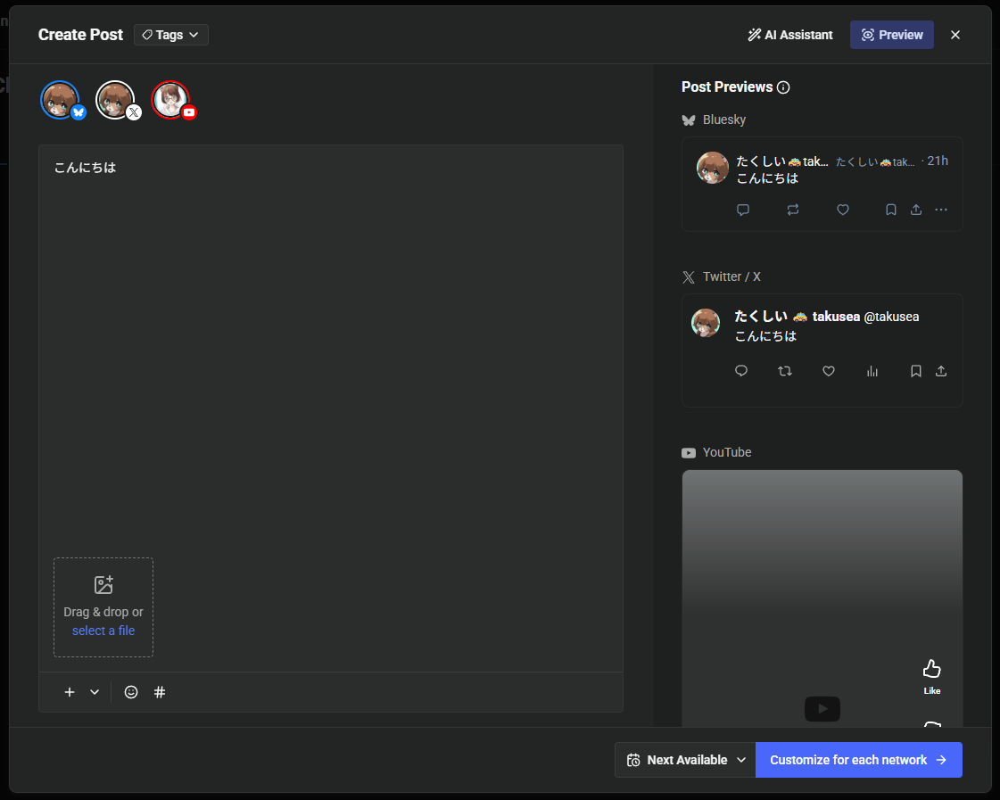
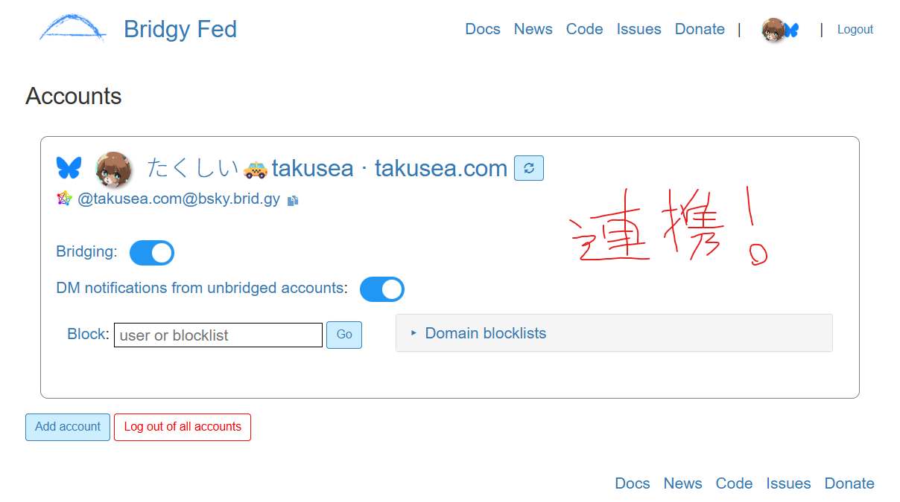
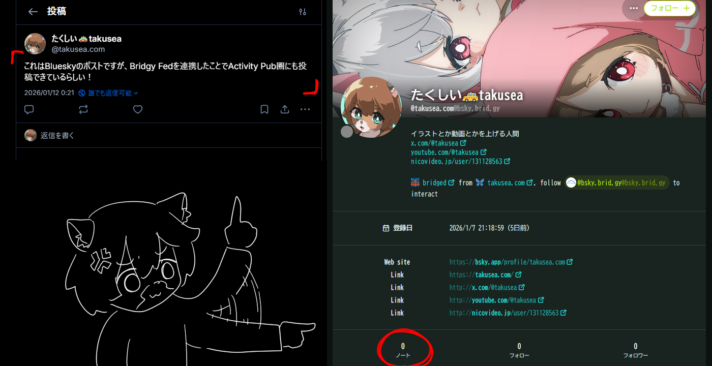

## やたらSNSが増える

Twitterが自認Xになりハチャメチャな感じになったりして早数年、その後釜を狙い幾多のSNSが立ち上げられた。

チクショウ、また乱立か！developerはすぐ企画・サービスを乱立させやがる！キャッシュレス決済の地獄を忘れたか！

イヤ、今回は違う！なぜならSNS同士で共通プロトコルで繋がっている！ここは皆がつながる夢の楽園だ！

…そして共通プロトコルが乱立（誇張）した（ActivityPub、ATプロトコル、Nostr）。

## 管理が大変

新規SNSの立ち上げの話題を聞いたときは大抵、怪しいものじゃなければID確保だけして、その後放置…が定型パターンである。新規SNSは非アクティブユーザー数だけかさ増しされ、投稿はない。投稿がなければ、見に来る人もいない。閑散とする。

うーん、どうにかできないか。そこで、せめてクロスポストで各SNSのアカウントのアクティブさを維持して廃墟感だけは無くすことにした。あと1つのSNSでも放置させてしまう性格なので、クロスポストの構造を作りギミック感を増加させることで、単なる投稿が楽しく感じられるようにしたい。

## クロスポスト化の方法

自分が取ったクロスポスト化の方法を紹介↓

### XとBluesky → Bufferで同時投稿

XとBlueskyの投稿は、Bufferから同時投稿で行うようにしました。

下記のようなUI。淡々と呟くにしては大げさなきらいはあります。

YouTube Shortも同時投稿できるらしいですが、これは使いどころはわからず。YouTubeならコミュニティの方を投稿できるようにしてほしい。

### BlueskyとActivityPub → Bridgy Fedで投稿を同期

Blueskyに投稿したポストを、Bridgy Fedを使いActivityPubへ投稿を同期することでクロスポストを実現！

…できるはずだった。

だけど同期できず…なぜ！？ひとまずラグがあるだけかもしれないので、様子を見ることにします。

## おわり

なんやかんやしましたが、とりあえず言いたいことは、どのSNSに軍配が上がっても「最初からこのSNSをメインにやっていこうと思っていましたヅラ」ができるように、クレヒスつける感じで様々なSNSに痕跡を残して行きましょう。
