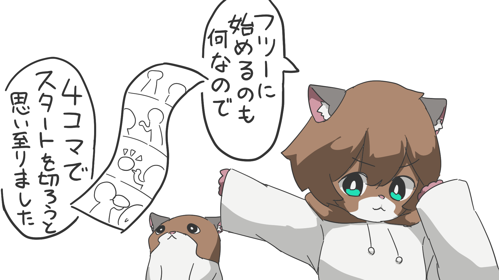
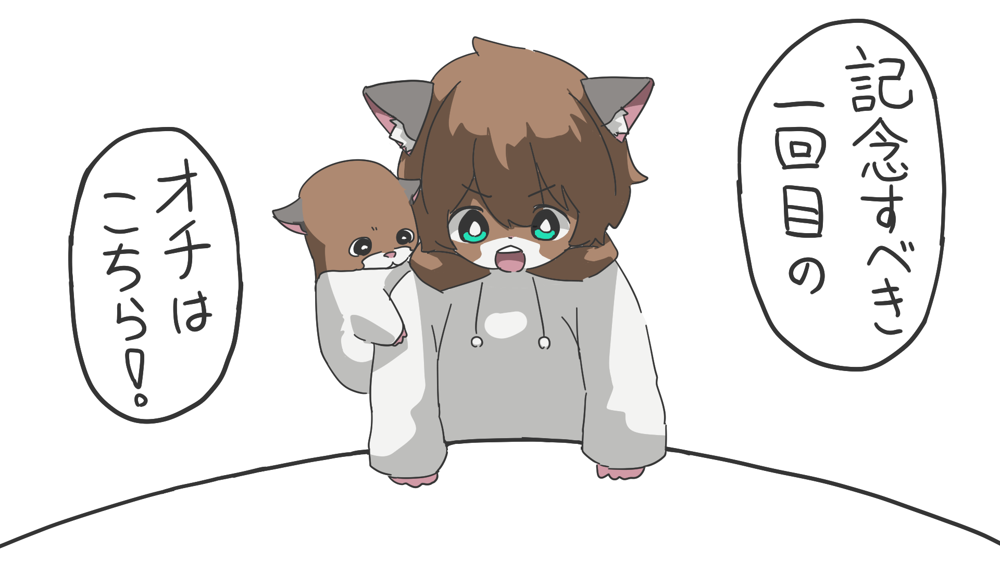

はじめまして、たくしいです。この度は雑記・備忘録と称してブログを始めてみることを試みることにしました。

理由は2つ、フロントの技術でブログを作る程度の基本的な流れを気になるフレームワークを通して体得しておこうという考えと、せっかくドメインを持ってるので死蔵したくはない！というもったいない精神。

[SNS](https://x.com/takusea)では趣味としてイラストを上げたりもしているので、なーんかしらイラストを交えるようなことをして親しみやすいような感じにできればいいかなと。

## 技術スタック

基礎のフレームワークとして[SolidJS](https://www.solidjs.com/)、SSG用に[SolidStart](https://start.solidjs.com/)を使用しています。コードの管理はGitHub。

ブログの記事作成はMarkdownで行い、[unified](https://unifiedjs.com/)（Remark/Rehype）とそのプラグイン群でHTMLに変換し表示しています。

また、記事用のMarkdownは[Obsidian](https://obsidian.md/)で書いています。ObsidianにはgitのプラグインがあるのでそこからリポジトリにPushしています。その都合でGitのリポジトリは記事Markdown専用リポジトリと、SolidJSのコード用のリポジトリに分かれる構造になっています。

デプロイはGitHub ActionsでGitHub Pagesに対して行っています。コード側のリポジトリにSSGでデプロイを行うアクションを配置し、記事側のリポジトリが更新された際にそのアクションをトリガーするアクションを実行するようにしています。より詳しくはまた記事を書くかも。

すべては、できればバックエンドサーバーやサービスの類の料金を支払わずに済ましたい、というケチさ故の構成です。

## 締めの4コマ

平凡に占めるのも何なので4コマ漫画を最後においておきます。

