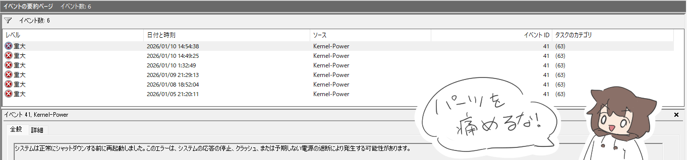
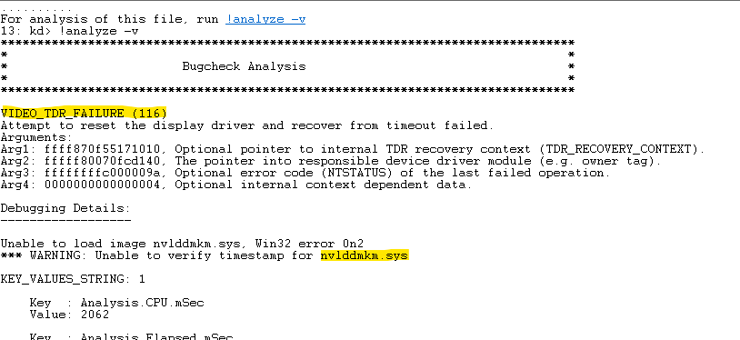

（今のところ解消したけど経過観察中）

## 前段

この度GPUをPalitのGTX 1080からASUS RTX 5070 DUAL（曖昧）に換装しました。元のグラボを買った瞬間にGTXからRTXへの転換が始まったので、長らくRTX所持者になれずじまいの状態が続きました。こんなんばっかり。

12月のブラックフライデーを機会を逃すまいと、メモリ高騰に釣られたPCパーツの値上げ局面ギリギリのタイミングを逃さなかったのは幸運だったなーと思います。という話はここまで、本題に入ります。

## 強制再起動に見舞われる

換装してからというもの、度々ランダムなタイミングで強制再起動がかかるようになってしまいました。最初のうちは頻度も低く、いきなり電源が切れるとパーツも痛むだろうしなんかヤダなーくらいでしたが、頻度が増えたのと、画面が暗いまま復帰しなくなる（PCは作動してそう）な状態になり、流石に解決しようと。

GPUだろうなあと当たりをつけつつ、復帰しなくなったときにマザボ側のHDMIに端子を付け替えたところ画面が点いたので、初期不良にビビりながら解決策を調べてみることに。

## 原因を調べる

### イベントビューアを見る

こんなときは兎にも角にもイベントビューア。見てみると、強制再起動のたびに重大レベルのイベントが発生していました。関係ありそう！

ただ、このイベント自体は何か強制的に電源が切られてて危ねえぞ！くらいの内容で原因が書いてあるものではありませんでした。残念。

ただ、近い時刻でダンプファイルを生成した旨のイベントが有りました。どうやら`C:\WINDOWS\Minidump\`にあるらしい。これを見ていきます。

### ダンプファイルを見る

ダンプファイルはバイナリファイルです。そのままだと特に見られるものではありません。そこで、Windows SDKに入っているWinDbgを使うことで解析してくれるらしいです。

下記サイトが参考になりました。

https://qiita.com/Q_Udon/items/fddd43937d3afe967b5d#windbg

Windows SDKを入れると`C:\Program Files (x86)\Windows Kits\10\Debuggers\`の`x64`、`x86`、`arm64`の3つのサブディレクトリにwindbg.exeが置かれているのでいづれかを実行します。大抵のPCはx64でいいです。

windbgを実行したら`C:\WINDOWS\Minidump\`内のダンプファイルを読み込みます。…がアクセス許可がなく読み込めません。自分は一度任意のディレクトリに移してから読み込みました。管理者権限で実行でもいいかも。

すると色々英文が出たあと末尾に青文字で`!analyze -v`と出ます。これをクリックして解析開始！

やたら色々と出てきます。が、中でも`VIDEO_TDR_FAILURE (116)`がエラーコードっぽい。VIDEO_とあるように、やはりグラボのエラーでした。`nvlddmkm.sys`というモジュール名もそれ関連。

## 問題解消

上記エラーコードやモジュール名について、Webで調べてみて出てくる対処法もやはりグラボ関連。その中から以下の2点を試行してみます。

- グラボドライバへの[DDU](https://www.wagnardsoft.com/display-driver-uninstaller-ddu)の使用
- 電源設定の変更

ドライバのダウングレードも様々なサイトで言及されていましたが、自分の場合はもとより最新ではない状態で発生していたのでスルー。

参考にしたのは色々ありますが主に下記のサイト。

https://eruakudiary.hatenablog.com/entry/2025/06/15/070236

DDUというものを初めて知りました。Display Driver Uninstallerの略、ディスプレイ関連のドライバをまっさらにしてくれるものです。確かに買い替えの際に過去のものに関して何もせず、ゴミを残留させたままになっていたように思います。これは良くなかった。

あと、DDUを使う際はセーフモードにすることをお忘れなく！

## 治った？

上記解決策をとって以来問題は発生していません。ただ、まだ数日なので解決したと言うには判断が早い！こういうのは問題が起きたら治ってないと言い切れるけど、起きなくても治ったとは言い切れないので難しい。

また問題が発生したら追記・修正します。
