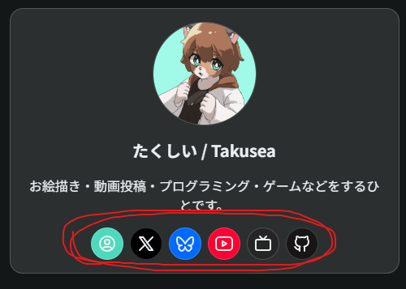
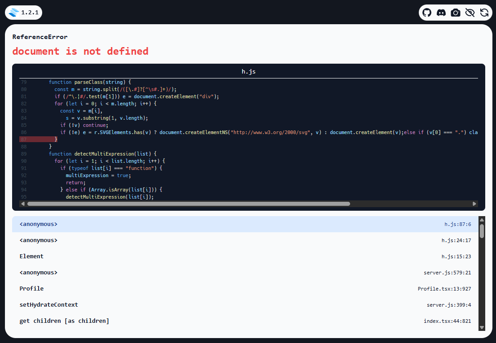

Tabler Icons、数あるアイコンライブラリの中でも種類が豊富で好きです。

ただ、SolidStartで使用する際に少し詰まったので備忘録をここに記す！

## エラーでページが表示されない

まず、愚直にTabler Iconsを使おうとしました。このブログでは右の（スマホだと下の）プロフィールリンクに使用しています。



コードは下記のような感じ。

```tsx
import styles from "./Profile.module.css";
import {
  IconBrandBluesky,
  IconBrandGithub,
  IconBrandX,
  IconBrandYoutube,
  IconDeviceTv,
  IconUserCircle,
} from "@tabler/icons-solidjs";

...
```

そしてProfileコンポーネントを使用したページにアクセスすると、`document is not defined`というエラーが発生しました。



## サーバー側でレンダリングするのでdocumentを参照できない

Tabler Iconsのコンポーネントの動作として、コンポーネントが宣言された箇所をdocumentから参照し、svgに置換する処理をします。そのため、documentが存在するクライアント側でないと動作しません。

## クライアント側でレンダリングするようにする

SolidStartの[clientOnly](https://docs.solidjs.com/solid-start/reference/client/client-only)関数を使います。

```tsx
import { clientOnly } from "@solidjs/start";
import styles from "./Profile.module.css";
  
const IconBrandBluesky = clientOnly(() =>
  import("@tabler/icons-solidjs").then((m) => ({
    default: m.IconBrandBluesky,
  })),
);
  
const IconBrandGithub = clientOnly(() =>
  import("@tabler/icons-solidjs").then((m) => ({
    default: m.IconBrandGithub,
  })),
);
  
const IconBrandX = clientOnly(() =>
  import("@tabler/icons-solidjs").then((m) => ({
    default: m.IconBrandX,
  })),
);
  
const IconBrandYoutube = clientOnly(() =>
  import("@tabler/icons-solidjs").then((m) => ({
    default: m.IconBrandYoutube,
  })),
);
  
const IconDeviceTv = clientOnly(() =>
  import("@tabler/icons-solidjs").then((m) => ({
    default: m.IconDeviceTv,
  })),
);

const IconUserCircle = clientOnly(() =>
  import("@tabler/icons-solidjs").then((m) => ({
    default: m.IconUserCircle,
  })),
);

```

この記述にすることで、エラーが解消し無事ページをレンダリングすることができました。

コンポーネントのレンダリングがクライアント側・サーバー側いずれで行われるべきか、気をつけましょう。。。
